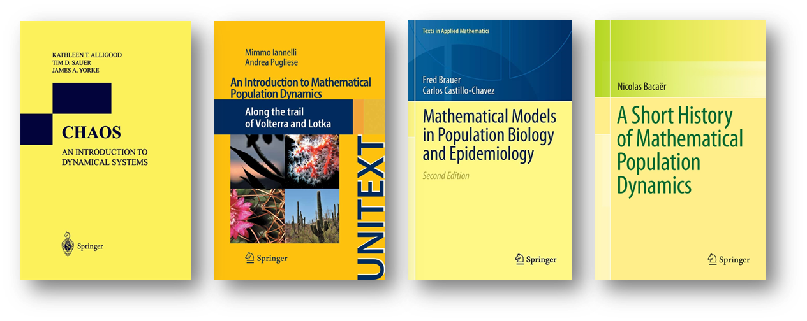

# Cazando incertidumbre: modelo presa-depredador bayesiano para la supervivencia del más apto

## Introducción
Este proyecto se desarrolló como parte del trabajo final de la asignatura `EST-46115: Modelación Bayesiana`. 

#### Objetivo del proyecto:
El objetivo del proyecto es permitir a los estudiantes de maestría explorar y conocer temas más especializados en el campo de aplicaciones de modelos bayesianos, que no pueden ser abarcados en un curso semestral. Los estudiantes tendrán la oportunidad de contribuir al desarrollo de uno de los proyectos enlistados y aprender a reproducir, evaluar y comparar modelos bayesianos en una aplicación específica. Además, se busca que los estudiantes encuentren una aplicación adicional del modelo en un campo distinto, utilizando datos de México.

#### Descripción del proyecto:
El proyecto final es una oportunidad para que los estudiantes de maestría profundicen en el campo de modelos bayesianos y exploren aplicaciones más especializadas. Se presentan distintos proyectos para que los estudiantes puedan elegir en qué equipo quieren contribuir y desarrollar el proyecto final de la materia. Los proyectos abarcan diferentes áreas y naturalezas, lo que permitirá a los estudiantes adquirir experiencia en la aplicación de modelos bayesianos en distintos contextos. La evaluación del proyecto se basará en la capacidad de los estudiantes para reproducir, evaluar y comparar modelos, así como en la identificación de una aplicación adicional del modelo en un campo distinto utilizando datos de México. Con este proyecto, los estudiantes podrán ampliar sus conocimientos en el campo de modelos bayesianos y adquirir habilidades prácticas en su aplicación.

## Integrantes del equipo

| GitHub user  | Integrante                 |
|--------------|----------------------------|
| David-Damian |David Damián Arbeu          |  
| BrandonHT    |Brandon Hernández Troncoso  | 
| aguilaral24  |Luis Alberto García Aguilar | 
| afuentesc    |Alberto Fuentes Chavarría   | 

## Referencias

- Carpenter, Bob. 2018. “Predator-Prey Population Dynamics: The Lotka-Volterra Model in Stan.” [Liga](https://mc-stan.org/users/documentation/case-studies/lotka-volterra-predator-prey.html)
- Alligood, K., T. D. Sauer, and K. Yorke J. A. 1996. CHAOS: An Introduction to Dynamical Systems. Springer.
- Bacaër, N. 2011. A Short Story of Mathematical Population. Springer.
- Brauer, Fred, and Carlos Castillo-Chavez. 2012. Mathematical Models in Population Biology and Epidemiology. Vol. 40. Texts in Applied Mathematics. New York, NY: Springer New York. [Liga](https://doi.org/10.1007/978-1-4614-1686-9)
- Czajkowski, C., and P. Schillak. 1990. “Iterative Solutions of the Lotka-Volterra Equations.” Il Nuovo Cimento D 12: 1477–80.
- Howard, P. 2009. “Modeling Modeling Modeling Basics Basics Basics. Lecture Notes for Math 442, Texas A&M University.”
- Iannelli,M., and Pugliese, A. n.d. An Introduction to Mathematical Population Dynamics. Vol. 79. Springer.
- Murty, K. N., M. A. S Srinivas, and K. R Prasad. 1990. “Approximate Analytical Solutions to the Three-Species Ecological System.” Journal of Mathematical Analysis and Applications 145 (1): 89–99.
- Volterra, V. 1926. “Variazioni E Fluttazioni Del Numero d’individui in Specie Animali Conviventi.” Mem. Acad. Sci. Lincei 2: 31–113.
